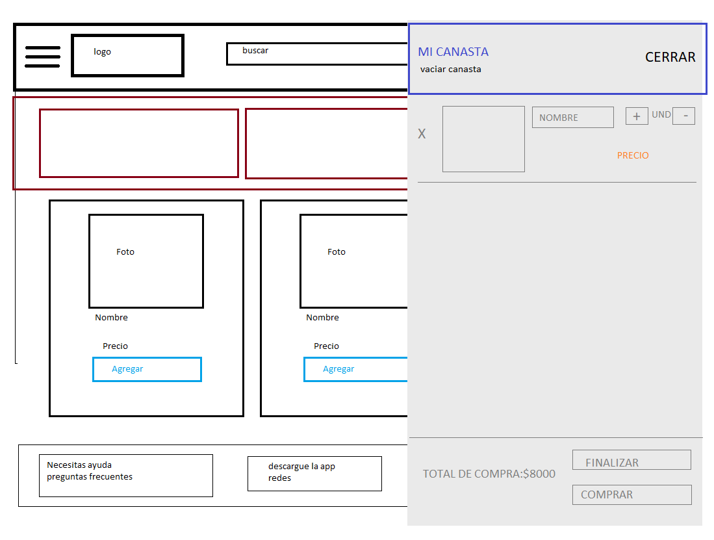
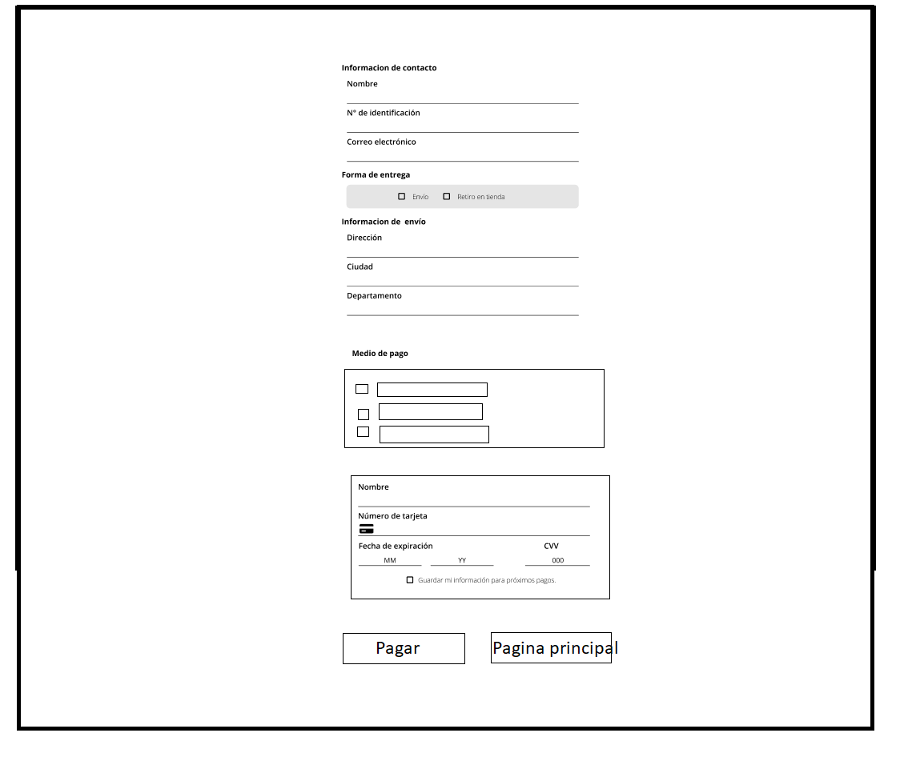
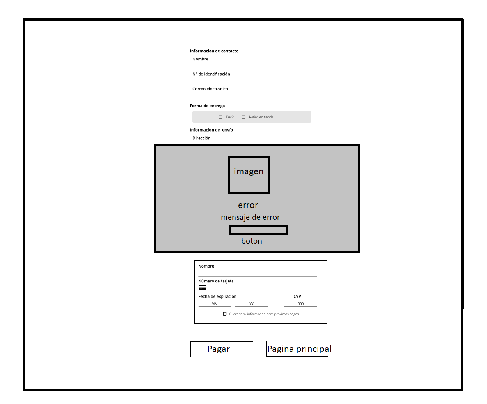
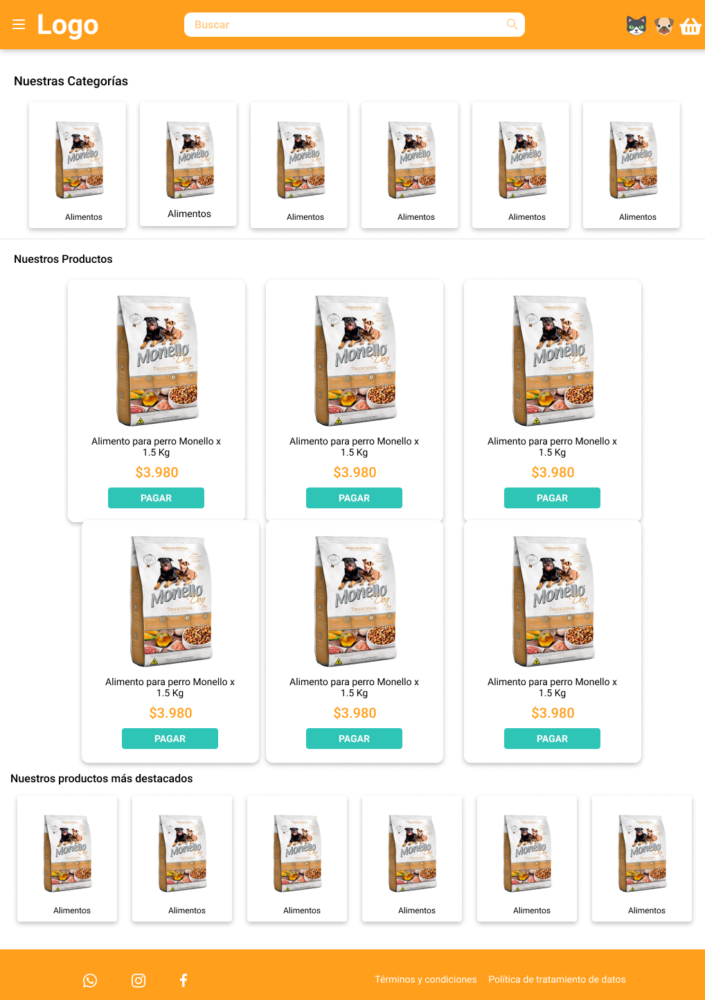
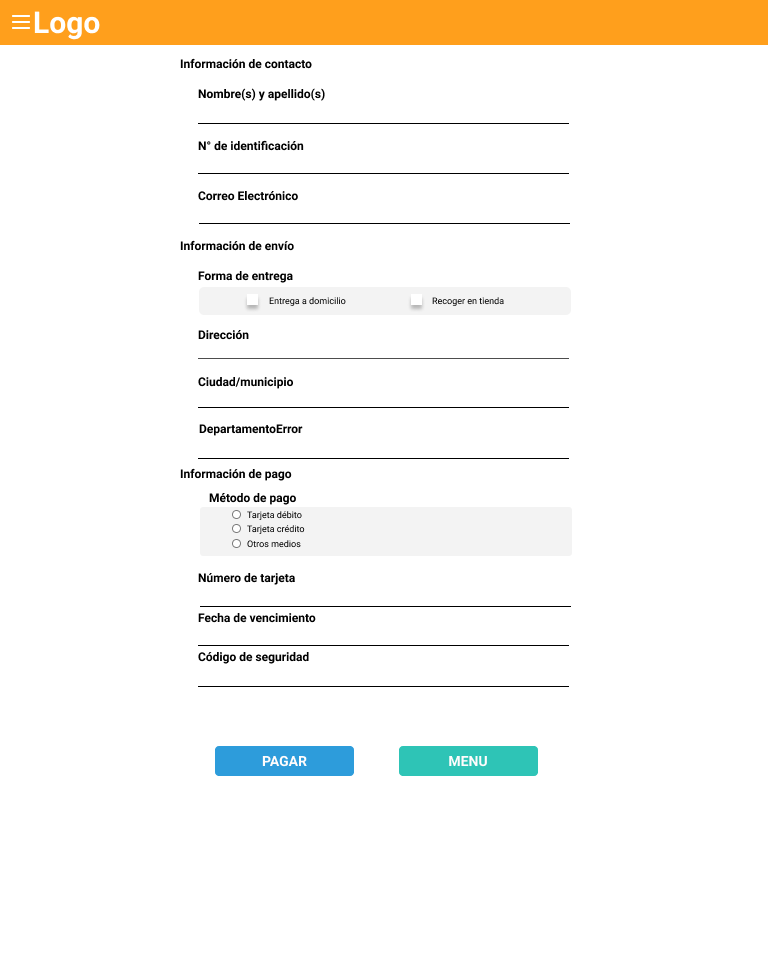

# Tienda de Mascotas
Tienda virtual especializada en productos de mascotas.

## Índice
* [1. Resumen del proyecto](#1-resumen-del-proyecto)
* [2. Producto final](#2-producto-final)
* [3. Investigación UX] (#3-investigacion-ux)
* [4. Demo] (#4-demo)
* [5. Autores] (#5-autores)

## 1. Resumen del proyecto
Desarrollamos un Aplicativo Web responsive para una tienda de mascotas, a partir de Javascript Vanilla, Html y Css, donde al finalizar la compra el cliente puede validar el número de su tarjeta de crédito y cuenta con la funcionalidad de ocultar todos los dígitos de su tarjeta exceptuando los últimos cuatro dígitos.

## 2. Producto final

<table>
    <tr>
      <td>Página principal</td>
      <td>Página principal con carrito desplazado </td>
    </tr>
    <tr>
      <td> </td>
      <td> </td>
    </tr>
    <tr>
      <td>Página de pago </td>
      <td>Página de pago con mensaje de alert </td>
    </tr>
    <tr>
      <td></td>
      <td></td>
    </tr>
  </table>

## 3. Investigación UX
En el desarrollo de nuestra página consideramos  aquellas personas que necesitan comprar algún producto para sus mascotas pero por algún motivo no podían desplazarse hasta ella, para ello les ofrecemos la opción de reclamar su pedido en tienda, cuando tengan tiempo disponible o envío a domicilio.

La página fue pensada para usuarios con mascotas con el objetivo de cubrir sus necesidades de obtener productos para sus hijos peludos de manera rápida, eficaz y online. Por tal motivo se habilitaron las opciones de pago en linea y recibir pedidos en casa o recogerlos en la tienda. Nuestra página presta servicios de manera competente ofreciendo todo un catálogo de productos para el cuidado de animales domesticos. 

### Prototipo Inicial
Se esbozo una idea principal de lo que sería el aplicativo.

<table>
    <tr>
      <td>Página principal</td>
      <td>Página principal con carrito desplazado </td>
    </tr>
    <tr>
      <td> </td>
      <td> </td>
    </tr>
    <tr>
      <td>Página de pago </td>
      <td>Página de pago con mensaje de alert </td>
    </tr>
    <tr>
      <td></td>
      <td></td>
    </tr>
  </table>

### Feedback

### Prototipo Final
Finalmente se desarrolo el último prototipado, por medio de la herramienta Figma, permitiendonos tener una idea más clara para el desarrollo de nuestra página en cuanto a colores y tamaños.

<table>
  <tr>
      <td>Componentes y colores </td>
      <td> Diseño alert </td>
    </tr>
    <tr>
      <td></td>
      <td></td>
    </tr>
    <tr>
      <td>Página principal</td>
      <td>Página de pagos </td>
    </tr>
    <tr>
      <td> </td>
      <td> </td>
    </tr>
    <tr>
      <td>Diseño canasta  </td>
      <td> Diseño alert dentro de la página</td>
    </tr>
    <tr>
      <td></td>
      <td></td>
    </tr>
  </table>

  ## 4.Demo
  
  ## 5. Autores
